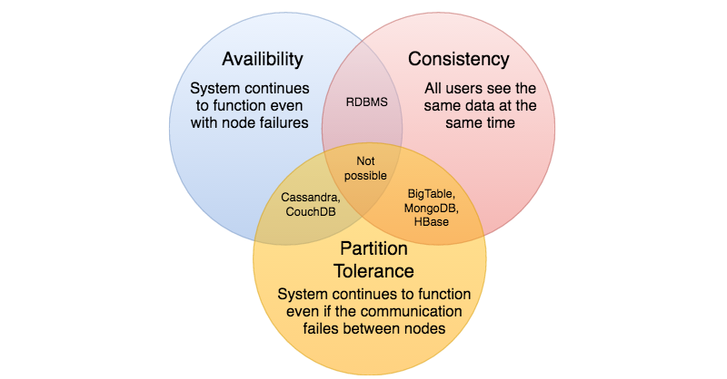

# CAP Theorem

## Consistency: 
All nodes see the same data at the same time. Consistency is achieved by updating several nodes before allowing further reads.

## Availability: 
Every request gets a response on success/failure. Availability is achieved by replicating the data across different servers.

## Partition tolerance: 
The system continues to work despite message loss or partial failure. A system that is partition-tolerant can sustain any amount of network failure that doesn’t result in a failure of the entire network. Data is sufficiently replicated across combinations of nodes and networks to keep the system up through intermittent outages.

We cannot build a general data store that is continually available, sequentially consistent, and tolerant to any partition failures. We can only build a system that has any two of these three properties.
